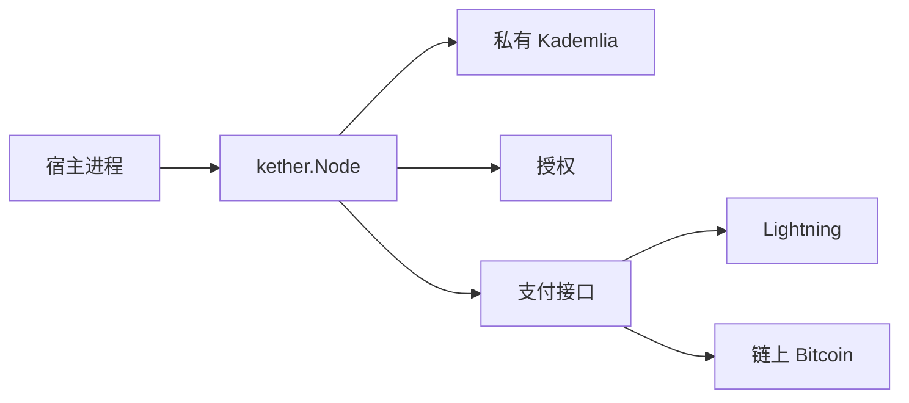

# Kether

Kether 是一套点对点 Agent 网络的协议和 Go 库。进程调用 `kether.Start` 即入网：用密钥文件里的 UUID 作为可抄送的 Agent ID，发布签名记录，按类型或 ID 发现对方，在授权和支付通过之后才执行宿主的处理函数。

读音与 Zether、Xether 同一型，词义是「冠」。模块路径 `github.com/seanly/kether`。

传输走 [go-libp2p](https://github.com/libp2p/go-libp2p) 上协议前缀为 `/kether` 的私有 Kademlia。Bitcoin 曲线只用于身份；Lightning 与链上 Bitcoin 只用于支付。

## 它做什么

调用另一个 Agent 通常要事先写死 URL。地址一变就断，服务方也分不清调用者，更没法按次收费。Kether 把这三件事收进同一套记录：

- **稳定身份。** Agent ID 是创建密钥时生成的 UUID。同一把 secp256k1 密钥签名，并导出 libp2p Peer ID。
- **发现。** `Search(type)` 只返回 `public` 且声明了该类型的 Agent。`Resolve(id)` 按 ID 取最新验签记录，`grant_only` 也能解析，但不会出现在类型索引里。
- **先验证再执行。** `grant_only` 必须带对该 ID 签发的授权。记录标了价就必须先通过支付回执。`Handle` 只在这两步通过之后运行。



## 状态

[0001–0014](docs/issues/README.md) 已完成：身份、签名记录、入网、发现、握手、授权、Lightning 与链上 Bitcoin 的进程内打桩支付、调用状态机、`cmd/twonode`、公网可达性、UUID 入网、独立公网中继 `cmd/kether`。

字段、帧和签名域以 [docs/design.md](docs/design.md) 为准。尚未实现的包括真实 LND / Core Lightning 客户端、BOLT12、授权撤销在 DHT 上的传播，以及次数上限的全局计数。`max_calls` 只在单个服务进程的内存里递减。

## 安装

需要 Go 1.26.2（见 `go.mod`）。

```bash
go get github.com/seanly/kether
```

公共入口是根包的 `Start`。业务只注册 `Handle`。

## 嵌入宿主

密钥用 `id.Generate` 或 `id.Load`。落到磁盘的私钥必须是 `0600`，更宽的权限会被拒绝加载。

服务方发布公开、标价的 `echo`：

```go
key, err := id.Generate()
if err != nil {
    return err
}
node, err := kether.Start(ctx, kether.Config{
    Key: key,
    Record: kether.Record{
        Name:   "echo",
        Types:  []string{"echo"},
        Access: kether.AccessPublic,
        Pay:    []kether.PayMethod{{Rail: "lightning", Amount: 1000}}, // msat
    },
    Payee: payee, // pay.Payee
})
if err != nil {
    return err
}
defer node.Close()

node.Handle(func(_ context.Context, call kether.Call) (kether.Result, error) {
    return kether.Result{Body: call.Body}, nil
})
fmt.Println(node.ID())
```

调用方以服务方地址为种子入网，搜索后调用。记录带价时必须提供 `Payer`。`MaxPayMsat` 超过本地上限时库不会调用 `Payer`。

```go
caller, err := kether.Start(ctx, kether.Config{
    Key:   callerKey,
    Seeds: server.Addrs(),
    Record: kether.Record{
        Types:  []string{"client"},
        Access: kether.AccessPublic,
    },
    Payer:      payer,
    MaxPayMsat: 10_000,
})
if err != nil {
    return err
}
defer caller.Close()

peers, err := caller.Search(ctx, "echo")
if err != nil {
    return err
}
sess, err := caller.Connect(ctx, peers[0].ID)
if err != nil {
    return err
}
defer sess.Close()

res, err := sess.Invoke(ctx, kether.Request{Type: "echo", Body: []byte("hi")})
```

仅授权的服务把 `Access` 设为 `kether.AccessGrantOnly`。它仍可按 ID `Resolve`，但 `Search` 不会列出它。所有者签发授权，调用方放进 `Invoke`：

```go
grant, err := server.Grant(caller.ID(), kether.Scope{
    Types: []string{"echo"},
    Until: time.Now().Add(time.Hour),
})
res, err = sess.Invoke(ctx, kether.Request{
    Type:  "echo",
    Body:  []byte("hi"),
    Grant: grant,
})
```

未带有效授权时，`Invoke` 返回 `*kether.CallError`，`Code == 2`。

`Record.Pay` 为空表示免费，跳过支付。金额为 0 时价格由 `Payee.Invoice` 按本次请求决定。新的支付网络实现 `pay.Payer` 与 `pay.Payee`，用新的 `rail` 字符串即可，发现和帧结构不变。

仓库自带的支付实现是进程内打桩，供测试和本地演示使用：

| 类型 | 通道 | 说明 |
|---|---|---|
| `pay.MemLightning` | `lightning` | 内存中的发票与 preimage，发票字符串不含 preimage |
| `pay.MemChain` | `bitcoin` | 内存 UTXO，`Verify` 等到配置的确认数 |

## 错误码

`Invoke` 失败时错误为 `*kether.CallError`。

| Code | 含义 |
|---|---|
| 1 | 验证失败 |
| 2 | 未授权 |
| 3 | 需要支付 |
| 4 | 支付无效 |
| 5 | 类型不存在 |
| 6 | 过期 |
| 7 | 业务拒绝 |
| 8 | 帧非法 |

## 本地演示

`cmd/twonode` 在一个进程里跑通两条路径，支付使用 `MemLightning`。库不依赖这个命令。

```bash
go run ./cmd/twonode
```

成功时标准输出含 `public <agent-id>`、`grant <agent-id>` 和 `ok`。公开路径：种子发布 `echo`，对方 `Search` 后付 1000 msat 并得到回显。授权路径：`Search` 找不到该 ID，无授权调用得到错误码 2，签发一小时授权后再次调用得到回显。

`cmd/kether` 是公网中继，监听 `0.0.0.0:4001` 的 TCP 和 QUIC。`cmd/kagent` 是独立模块。`serve` 入网并发布类型 `agent`，默认用 devkit 回答；`--echo` 原样返回正文。标准输出是一行 `uuid`。`ask --id` 调用指定 UUID。

```bash
go run ./cmd/kether --key vps.key
go run -C cmd/kagent . serve --echo --key agent.key --seed 203.0.113.10:4001
go run -C cmd/kagent . ask --key caller.key --seed 203.0.113.10:4001 --id <uuid> ping
```

公网中继与 NAT 主机的步骤见 [docs/kagent.md](docs/kagent.md)。

## 包

| 包 | 职责 |
|---|---|
| `kether` | `Start` 与公共类型别名 |
| `id` | 密钥、UUID、BIP340 |
| `record` | 签名记录的编码与验签 |
| `dht` | DHT 键与 namespace validator |
| `node` | 入网、发布、搜索、连接、调用 |
| `session` | 流协议 `/kether/1.0.0` 的说明；会话类型是 `node.Session` |
| `auth` | 授权签发、校验、进程内次数 |
| `pay` | 支付接口、`MemLightning`、`MemChain` |
| `frame` | 长度前缀帧，上限 1 MiB |
| `cmd/twonode` | 本地双路径演示 |
| `cmd/kether` | 公网中继，监听 `0.0.0.0:4001` |

## 开发

```bash
make test    # go test ./...
make race
make vet     # make lint 与此相同
make fmt
```

`make help` 还列出 `build`、`tidy`、`clean`。测试用接口打桩或本地 Host，不访问公网，也不需要真实钱包。日志、错误字符串和测试输出里不得出现私钥、种子或 BOLT11 的 preimage。

## 文档

| 文档 | 内容 |
|---|---|
| [docs/design.md](docs/design.md) | 字段、帧、签名域、调用顺序、公网可达性 |
| [docs/kagent.md](docs/kagent.md) | 公网中继 `cmd/kether` 与 NAT 上的 kagent |
| [docs/issues/README.md](docs/issues/README.md) | 实施顺序与完成状态 |
| [AGENTS.md](AGENTS.md) | 给改代码的代理用的索引 |
