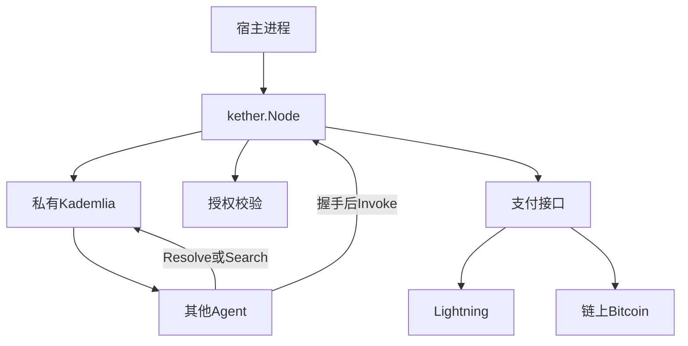
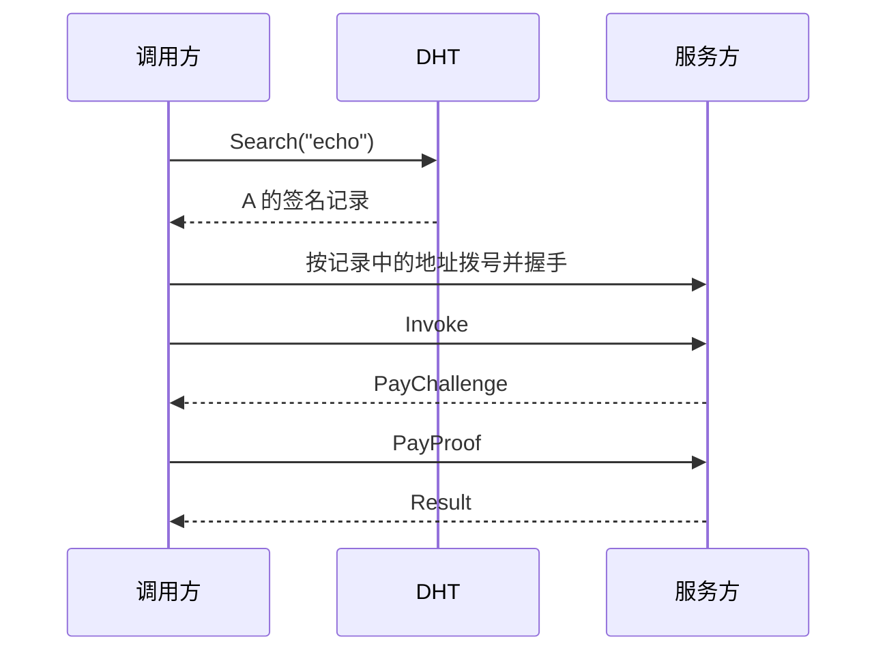

# Kether 设计文档

> 读者：实现本项目的 Go 工程师。
> 阅读顺序：本文 → [docs/issues/README.md](issues/README.md) → 各 issue。
> 状态：0001–0011 已实现。字段、帧和签名域以本文为准。issue 只描述交付切片和验收，不另起一套编码。

Kether 读音与 Zether、Xether 同一型。词义是「冠」。它不是 Boneh 等人 2019 年的 Zether 隐私支付协议，也不是 2019 年的 Xether 代币。

## 问题

一个 Agent 要调用另一个 Agent，今天通常要事先知道对方的 URL，并把地址写进配置。地址一换，调用方就断。对方也无法用一个稳定身份区分「谁在调用」，更无法按调用收费。

Kether 把这三件事收成一套协议和 Go 库：

- 进程启动后即成为网络中的一个 Agent。
- 每个 Agent 有一个类似比特币钱包地址的 ID，可抄送、可搜索、可授权。
- 调用方按类型发现，或按 ID 直连。服务方公开自己，或只放行被授权的 ID。
- 调用在执行前完成支付。支付通道可替换，第一版实现 Lightning 和链上 Bitcoin。

人通过自己的进程使用这张网：把一个 ID 或一个类型交给本机 Agent，由它完成发现、连接、付款和调用。

## 目标

- 一个 Go module，嵌入宿主进程即可入网。宿主负责业务处理函数，库负责入网、发现、授权、收款。
- Agent ID 由 secp256k1 公钥决定，与 Bitcoin、Lightning 使用同一条曲线和 BIP340 签名。
- 启动后连接种子节点，发布签名记录，并能解析其他 Agent。
- 公开记录可按类型被搜索。仅授权记录仍可按 ID 解析，但调用必须携带该 ID 签发的授权。
- 支付失败的调用不会进入业务处理函数。

## 本版范围

- 身份、签名记录、私有 Kademlia DHT、直连调用。
- 访问模式 `public` 与 `grant_only`。
- 授权的签发、出示、过期。撤销留到记录序号机制，第一段代码用短过期授权。
- 支付接口，以及 Lightning（BOLT11）和链上 Bitcoin 两个实现。
- 两个进程加一个种子的本地演示。

## 后续

- BOLT12 offer、其他支付网络。
- 授权撤销记录在 DHT 上的传播，以及次数上限的全局计数。
- 信誉、类型命名空间治理、中继收件箱。
- 把 Bitcoin 交易当作目录锚点。发现在第一版完全由 Kether 自己的 DHT 完成。

## 名词

| 词 | 含义 |
|----|------|
| Agent ID | `keth1...`，x-only 公钥的 bech32m 编码 |
| 记录 Record | 某 ID 当前的地址、类型、访问模式和支付方式，由该 ID 签名 |
| 类型 Type | 记录上的能力标签，例如 `echo`、`translate` |
| 授权 Grant | 所有者签给另一个 Agent ID 的调用许可 |
| 通道 Rail | 一种支付实现，例如 `lightning`、`bitcoin` |
| 种子 Seed | 启动时拨号的已知节点地址 |

## 总览



一次公开调用：



## 分层

1. **身份。** secp256k1 密钥、Agent ID、BIP340。
2. **传输。** libp2p 连接、NAT 打洞、加密会话。传输身份是 libp2p Peer ID，由同一把公钥导出。
3. **目录。** 签名记录放在本协议私有的 Kademlia DHT 里。
4. **会话。** 按记录拨号，握手证明双方持有各自私钥。
5. **调用。** 帧上的 `Invoke` / `PayChallenge` / `PayProof` / `Result`。
6. **业务。** 宿主注册的处理函数。库在授权和支付都通过之后才调用它。

Bitcoin 的 P2P 网继续只转发区块和交易。Kether 使用它的曲线做身份，使用 Lightning 和链上交易做支付。

## 身份

每个 Agent 一把 secp256k1 密钥。签名使用 BIP340（Schnorr，x-only 公钥 32 字节）。私钥留在本机，文件权限 `0600`。

Agent ID 的编码：

- 人类可读前缀 HRP：`keth`
- 校验：bech32m（BIP 350）
- 数据：1 字节版本 `0x00`，后接 32 字节 x-only 公钥
- 版本不是 `0x00` 的 ID，当前实现拒绝

示例形态：`keth1...`。ID 可以抄给别人，当作搜索和授权的主键。

libp2p 的 Peer ID 是公钥 protobuf 的多重哈希，与 `keth1...` 字符串不同。同一把公钥同时产生两者。签名记录里同时写下 Agent ID 和 Peer ID，调用方验签后再拨号。连接建立后，握手再次确认对端公钥等于记录里的公钥。

## 节点如何入网

`Start` 读取密钥和种子 multiaddr 列表，创建 libp2p Host，加入协议 ID 为 `/kether/kad/1.0.0` 的 Kademlia DHT。这个 DHT 只在 Kether 节点之间使用，不写入公共 IPFS DHT。

入网顺序：

1. 拨号种子。至少一个种子可达，否则 `Start` 返回错误。
2. 启动 DHT 路由表引导。
3. 若配置了记录，签名并发布，然后按 `ExpiresAt` 的一半周期刷新。
4. 开始接受 `/kether/1.0.0` 流。

本地演示可以让其中一个进程只做种子：它入网、发布自己的记录，并接受其他节点的 DHT 查询。生产环境的种子是若干长期在线的普通节点，没有单独的目录服务器角色。

## 签名记录

记录是目录里的全部内容。正文用 protobuf，签名覆盖域分隔符和去掉 `signature` 字段后的确定性编码。

```text
Record
  uint32   version = 1
  bytes    pubkey              // 32 字节约 x-only
  string   peer_id             // libp2p Peer ID 文本
  uint64   seq                 // 同一 ID 下单调递增，数值大的记录胜出
  int64    expires_at          // Unix 秒
  string   name                // 可选，最长 64 字节，只用于展示
  repeated string types        // 最多 8 个
  uint32   access              // 0 public，1 grant_only
  repeated string addrs        // multiaddr，最多 8 个
  repeated PayMethod pay       // 最多 4 个
  bytes    signature           // BIP340，64 字节
```

`PayMethod`：

```text
PayMethod
  string rail                 // "lightning" 或 "bitcoin"
  string hint                 // lightning: BOLT11 的节点或 offer 提示；bitcoin: 收款描述
  uint64 amount               // lightning 为 msat；bitcoin 为 sat。0 表示调用时另开价
```

类型标签字符集：`[a-z0-9]([a-z0-9_-]{0,31})`。主机在发布前拒绝非法标签。

签名输入：

```text
ASCII("kether/record/v1") || 0x00 || CanonicalRecordBytes
```

`CanonicalRecordBytes` 是 `signature` 置空后的 protobuf 确定性编码。验签公钥必须等于 `pubkey`，且 `pubkey` 编码出的 Agent ID 必须等于 DHT 键里的那个 ID。

验证一条记录时全部满足才采纳：

- 版本为 1，签名通过。
- `seq` 不低于该 ID 已经见过的序号。序号相等时，保留先到的一条。
- `expires_at` 晚于本地时间减去 120 秒。
- `peer_id` 能解析，且与 `pubkey` 导出的 Peer ID 一致。
- `addrs` 非空。

过期记录不再当作在线。发布者在过期前刷新，并递增 `seq`。

### DHT 键

| 键 | 值 | 谁写入 |
|----|----|--------|
| `/kether/agent/1/<agent-id>` | 该 ID 的最新记录 | 记录所有者 |
| `/kether/type/1/<type>` | 声明该类型且 `access = public` 的 Agent ID 列表条目 | 记录所有者，每个类型一条 provider |

`grant_only` 的记录只写 agent 键，不写 type 键。知道 ID 的人可以 `Resolve`，按类型搜索不到它。

私有 DHT 的单值上限设为 8 KiB。记录超过上限时拒绝发布。公共 IPFS DHT 的小记录限制不适用于这里。

## 发现

`Resolve(id)`：

1. 向 DHT 读取 `/kether/agent/1/<id>`。
2. 执行上一节的验证。
3. 返回记录。验证失败则返回错误，不把地址交给调用方。

`Search(type)`：

1. 查找 `/kether/type/1/<type>` 的 provider。
2. 对每个 Agent ID 做 `Resolve`。
3. 丢掉过期、验签失败、`access != public` 或类型列表里没有该标签的记录。
4. 按 `seq` 新的在前返回。调用方自己选定要连接的 ID。

类型没有全局注册机构。任何人都能发布 `translate`。搜索结果是候选人列表，选择权在调用方。

## 访问控制

`access = public`：任何完成支付的 Agent 都可以调用记录里列出的类型。

`access = grant_only`：调用帧里必须带一份授权，且同时满足：

- 授权由记录的公钥签名。
- `grantee` 等于当前连接握手证明的调用方 Agent ID。
- 请求的类型出现在授权的 `types` 里。
- 本地时间落在 `[not_before - 120s, not_after + 120s]`。
- `seq` 大于该授权方已见过的撤销水位。第一段代码的撤销水位恒为 0，许可完全靠 `not_after`。

授权正文：

```text
Grant
  uint32 version = 1
  bytes  grantor_pubkey
  bytes  grantee_pubkey
  repeated string types
  int64  not_before
  int64  not_after
  uint64 max_calls          // 0 表示在时间窗内不限次数
  uint64 max_amount_msat    // 0 表示不在授权里封顶
  uint64 seq
  bytes  signature
```

签名输入：`ASCII("kether/grant/v1") || 0x00 ||` 去掉签名后的确定性编码。

授权有两种交付方式。调用方连接时放进 `Invoke`。或者所有者把授权发给被授权方，由对方保存。授权不进入类型索引。

第一版不实现跨节点的次数计数。`max_calls` 只在单个服务进程的内存里递减，重启后重新计数。需要硬上限时，把 `not_after` 设短。

## 连接与帧

应用流协议 ID：`/kether/1.0.0`。

帧：

```text
uint32be length || Envelope
```

`length` 是 Envelope 的字节数，上限 1 MiB。超限则关闭流。

```text
Envelope
  uint64 corr_id
  oneof body {
    Hello        hello = 1;
    HelloAck     hello_ack = 2;
    Invoke       invoke = 3;
    PayChallenge challenge = 4;
    PayProof     proof = 5;
    Result       result = 6;
    Error        error = 7;
  }
```

握手：

1. 调用方按记录里的 multiaddr 拨号，打开 `/kether/1.0.0`。
2. 双方发送 `Hello`：本方 Agent ID、32 字节随机数、对 `ASCII("kether/hello/v1") || 对方出现在记录中的 Agent ID || 双方随机数` 的 BIP340 签名。调用方在收到服务方随机数后补发签名；实现上服务方先发 `Hello`，调用方回 `Hello` 与对服务方随机数的签名，服务方再发 `HelloAck`。
3. 双方检查对端公钥、Agent ID、Peer ID 与用来拨号的那条记录一致。
4. 失败则发送 `Error` 并关闭流。同一 Host 上的后续调用可以复用已经握手成功的流，每条调用使用新的 `corr_id`。

`Invoke`：

```text
Invoke
  string type
  bytes  body                 // 宿主定义的请求字节，库不解释
  bytes  grant                // grant_only 时必填，public 时为空
  bytes  nonce                // 16 字节
  int64  sent_at
```

服务方缓存 `(caller_id, nonce)` 直到 `sent_at + 10 分钟`。重复 nonce 返回 `Error`，避免支付回执被重放进第二次执行。

## 支付

库在调用处理函数之前完成收款。协议只规定挑战和回执的形状，具体验票由通道实现。

```text
PayChallenge
  string rail
  uint64 amount
  string invoice              // lightning: BOLT11；bitcoin: 本次调用专属地址
  bytes  request_hash         // SHA256(type || body || caller_id || callee_id || nonce)
  int64  expires_at
  bytes  signature            // 服务方对挑战正文的 BIP340

PayProof
  string rail
  bytes  receipt              // lightning: 32 字节 preimage；bitcoin: txid
```

服务方为每次 `Invoke` 新开一个挑战。挑战单次有效。`PayProof` 对不上当前 `corr_id` 的挑战则拒绝。

### 接口

```text
Payer
  Pay(ctx, challenge) (receipt, error)

Payee
  Invoice(ctx, req) (challenge, error)
  Verify(ctx, challenge, receipt) error
```

宿主在 `Start` 时注入要用的 `Payer` 和 `Payee`。记录里的 `pay` 告诉对方本节点接受哪些 `rail`。调用方的 `Payer` 必须实现其中至少一个，否则在付款步骤失败。

金额为 0 的记录表示价格由 `Invoice` 按本次请求决定。金额非 0 时，`Invoice` 必须使用记录中的金额。

### Lightning

`rail = "lightning"`。`Invoice` 向本机 Lightning 节点申请 BOLT11。发票的 description hash 设为 `request_hash`，金额等于约定的 msat，过期时间不晚于挑战的 `expires_at`。

`Pay` 支付该发票。`Verify` 检查 preimage 的 SHA256 等于发票的 payment hash，并且该发票是本进程为这个 `request_hash` 签发的。支付实现第一版通过本机 LND 或 Core Lightning 的已有接口完成，库不实现闪电网络本身。

本地演示使用 regtest 上的两份 Lightning 节点。

### 链上 Bitcoin

`rail = "bitcoin"`。`Invoice` 从服务方钱包派生一个本次调用专用的收款地址，把 `request_hash` 与该地址记在内存里。`amount` 单位是 sat。

`Verify` 在配置的确认数到达后，检查该地址收到不少于约定金额的输出。默认确认数：regtest 为 1，其他网络为 1，由配置提高。地址只接受一次证明，用过即丢弃。

链上通道适合可以等待确认的调用。按次、低延迟的调用用 Lightning。

### 其他支付网络

新通道实现 `Payer` 与 `Payee`，使用新的 `rail` 字符串。发现、授权和帧结构不变。记录里多写一种 `PayMethod` 即可对外宣布。

## 调用规则

服务方收到 `Invoke` 后的顺序固定：

1. 类型必须出现在自己的当前记录里。
2. `grant_only` 时验证授权。`public` 时忽略 `grant` 字节。
3. 检查 nonce。
4. 若记录带有 `PayMethod`，发送 `PayChallenge`，等待 `PayProof` 并 `Verify`。记录的 `pay` 为空表示该 Agent 免费，跳过此步。
5. 调用宿主处理函数。
6. 发送 `Result`。处理函数返回错误时发送 `Error`，不把内部错误文本以外的内容写入帧。`Error` 只含稳定的代码和一句短消息。

```text
Result
  bytes body

Error
  uint32 code
  string message
```

错误码：`1` 验证失败，`2` 未授权，`3` 需要支付，`4` 支付无效，`5` 类型不存在，`6` 过期，`7` 业务拒绝，`8` 帧非法。

处理函数看到的 `Call` 已经去掉了未通过的请求。它收到调用方 Agent ID、生效的授权（公开调用时为空）、已验证的回执、类型和 body。

## Go API

模块路径 `github.com/seanly/kether`。库的公共包名是 `kether`。

```go
node, err := kether.Start(ctx, kether.Config{
    Key:   key, // *secp256k1.PrivateKey，ID 由此导出
    Seeds: []string{"/ip4/127.0.0.1/tcp/4001/p2p/12D3Koo..."},
    Record: kether.Record{
        Name:   "echo",
        Types:  []string{"echo"},
        Access: kether.AccessPublic, // 或 AccessGrantOnly
        Pay: []kether.PayMethod{{
            Rail:   "lightning",
            Amount: 1000, // msat
        }},
    },
    Payee: lightningPayee,
    Payer: lightningPayer,
})

peers, err := node.Search(ctx, "echo")
rec, err := node.Resolve(ctx, otherID)

grant, err := node.Grant(otherID, kether.Scope{
    Types:    []string{"echo"},
    Until:    time.Now().Add(time.Hour),
    MaxCalls: 10,
})

sess, err := node.Connect(ctx, otherID)
result, err := sess.Invoke(ctx, kether.Request{
    Type:  "echo",
    Body:  payload,
    Grant: grant, // public 对方可省略
})

node.Handle(func(ctx context.Context, call kether.Call) (kether.Result, error) {
    return kether.Result{Body: call.Body}, nil
})
```

`Connect` 内部 `Resolve`，拨号，完成握手。`Invoke` 在收到 `PayChallenge` 时调用配置的 `Payer`。

`ID()` 返回本节点的 `keth1...`。`Close` 停止刷新并关闭 Host。

## 仓库布局

```text
kether/
├── go.mod
├── id/            // 密钥、bech32m、BIP340
├── record/        // 记录编码与验签
├── dht/           // 键、发布、Resolve、Search
├── node/          // Start、Connect、刷新
├── session/       // 帧、握手、Invoke 状态机
├── auth/          // Grant 签发与校验
├── pay/           // 接口、lightning、bitcoin
├── frame/         // protobuf 与长度前缀
├── cmd/twonode/   // 两个进程的本地演示
└── docs/issues/
```

`cmd/twonode` 不进入库的公共 API。

## 安全

- **冒充。** 记录、授权、握手都验 BIP340。拨号地址来自验签后的记录，握手再核对公钥和 Peer ID。攻击者可以在 DHT 里写入垃圾，写不了别人的 ID。
- **重放。** 调用 nonce 在服务端去重。支付挑战单次有效，链上地址用后作废。
- **过期与回滚。** 同一 ID 只接受更高的 `seq`。过期记录不可拨号。
- **隐藏节点。** DHT 被遮蔽时，`Resolve` 失败或拿到旧记录。旧记录过期后自然失效。调用方收到的地址仍必须通过签名检查。
- **类型冒充。** 搜索不保证能力真实。调用方按 Agent ID 决定是否连接。
- **公开调用的滥用。** `public` 且 `pay` 非空时，未付款的请求停在支付步骤。`pay` 为空的公开 Agent 自行接受免费调用的成本。
- **授权外泄。** 授权绑定 grantee 公钥。偷到授权字节的第三方通不过握手。
- **时钟。** 过期判断允许 120 秒偏差。授权窗口要长于这段偏差。
- **金额。** `Payer` 由调用方实现，可以在支付前拒绝超过本地上限的挑战。库提供配置项 `MaxPayMsat`，超过则不调用 `Payer`。

## 实施

实施计划、里程碑和每篇 issue 的验收在 [docs/issues/README.md](issues/README.md)。下面两条路径是 issue 0010 的演示，不在库的公共 API 里实现第二套逻辑。

## 最小实现切片

在一台机器上验证两条路径。

**公开路径**

1. 进程 A 作为种子启动，`AccessPublic`，类型 `echo`，Lightning regtest 标价 1000 msat。
2. 进程 B 以 A 为种子启动，`Search("echo")` 得到 A 的 ID。
3. B `Connect` 并 `Invoke`。A 发出 BOLT11，B 支付，A 的处理函数回显 body。

**授权路径**

1. A 改为 `AccessGrantOnly`，类型索引里没有 A。
2. B 的 `Search("echo")` 为空。B 仍可用事先知道的 ID `Resolve`。
3. 未带授权的 `Invoke` 得到错误码 `2`。
4. A 对 B 的 ID 签发一小时授权。B 携带授权再次 `Invoke` 并完成支付，得到回显。

这两条路径通过之后，再补链上 Bitcoin 通道和授权的 `max_calls` 内存计数。

## 实现时的决定

下面这些在本文已经定死，避免实现时另起一套：

- 身份签名是 BIP340，ID 编码是 HRP `keth` 的 bech32m，版本字节 `0x00`。
- 目录是协议前缀 `/kether/kad/1.0.0` 的私有 DHT，单值上限 8 KiB。
- Agent ID 与 libp2p Peer ID 都写进记录，由同一公钥导出，握手时两边都核对。
- `grant_only` 不写入类型索引。
- 处理函数只在授权和支付都通过之后运行。
- 第一段代码的授权撤销靠 `not_after`，不靠额外的撤销网络。
